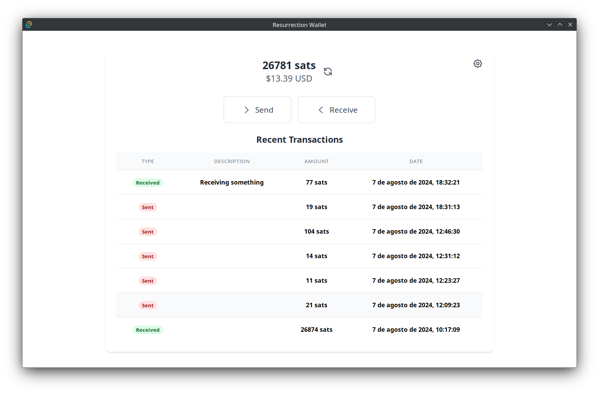
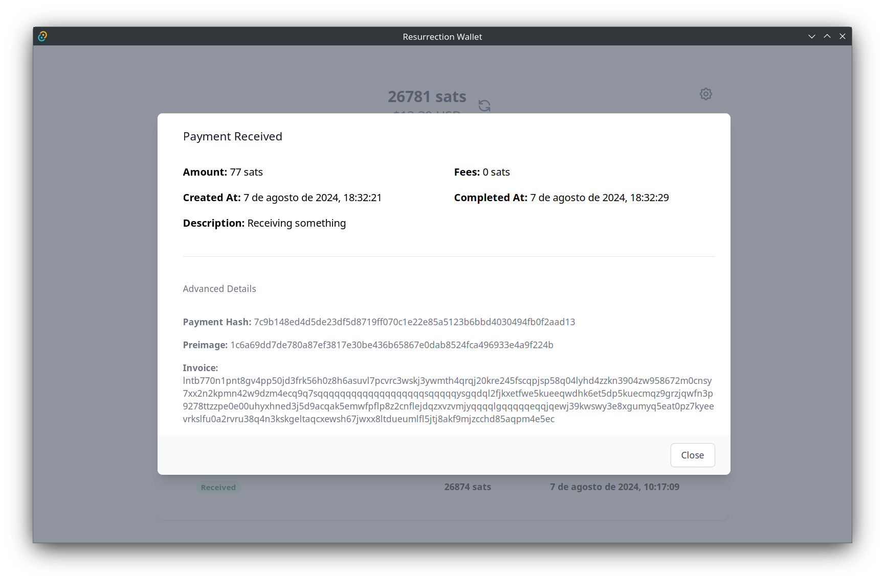
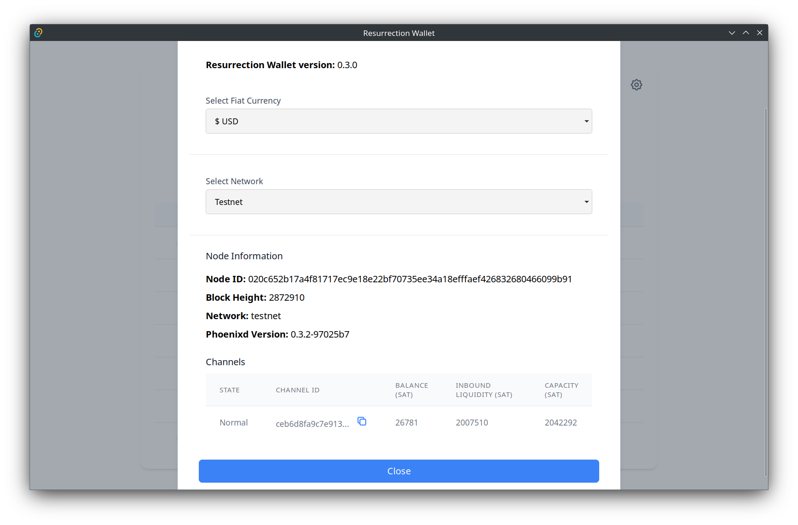

# Resurrection Wallet
Resurrection Wallet is a frontend for [Phoenixd](https://github.com/phoenixrails/phoenixd), a lightweight, non-custodial Bitcoin wallet with some advanced features like auto-liquidity.

Features:
- [x] Linux x86_64 support
- [ ] MacOS support
- [x] Autoinstall Phoenixd
- [x] Use mainnet or testnet
- [x] Read the password from phoenixd.conf
- [x] Update balance and transactions automatically when a new payment is received / sent
- [x] Create invoice and receive payments
- [x] Pay bolt11 invoices
- [x] Pay bolt12 offers
- [ ] Pay Lightning Addresses
- [ ] Pay onchain addresses
- [ ] Show fiat value in different currencies
- [ ] Scan QR Codes to pay invoices/offers ---> it works, but it's not very reliable
- [ ] Auto-update app
- [ ] Auto-update Phoenixd
- [ ] Manage the phoenixd process better
    - [ ] Detect if Phoenixd is running
    - [x] Kill Phoenixd when the app is closed
- [ ] Detect WebSocket disconnections / manage reconnection

Main Screen

Transaction details

Setup Screen

## Installation

Download the latest release from the [releases page](https://github.com/ktecho/resurrection-wallet/releases/latest) and run it. AppImages are recommended because they'll be easier to update to the next version.

It will prompt you to install Phoenixd automatically. If you already have Phoenixd installed, a new version will be downloaded and installed automatically, but you'll be able to use the same wallet, channels, etc.

## Tech Stack
- Tauri (Rust)
- SvelteKit
- Tailwind

## Development environment
(to be improved)
- Install Rust (https://www.rust-lang.org/tools/install)
- Install Tauri v2 dependencies
- Run "yarn run tauri dev"